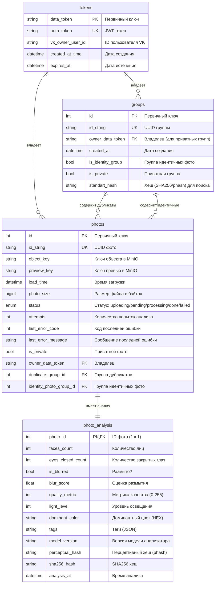
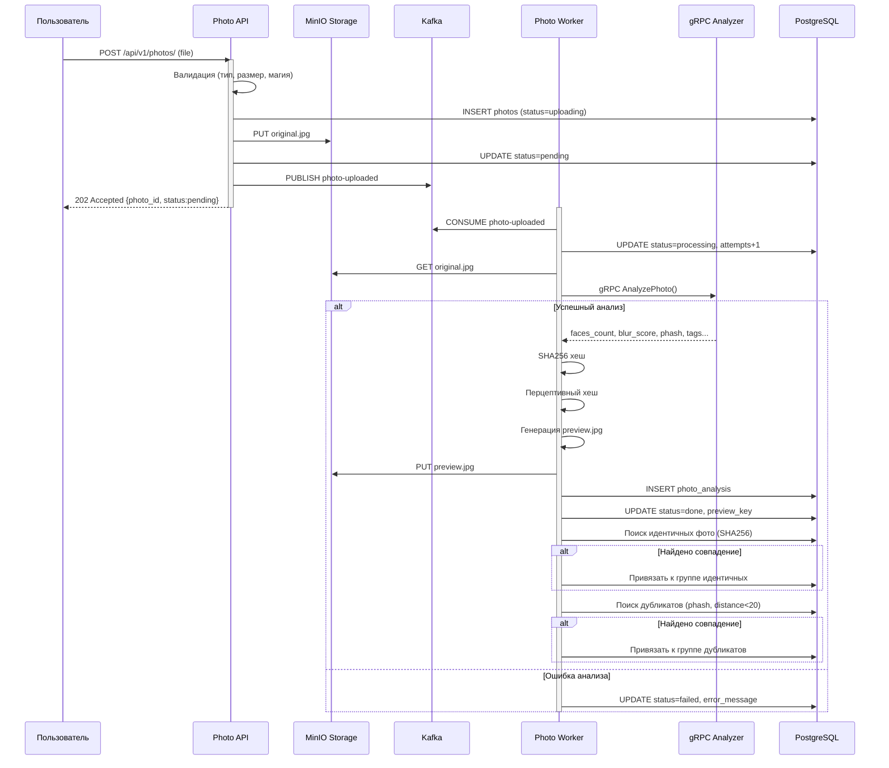

# Архитектура

## C4 Component — компоненты API

```mermaid
C4Component
  title Component diagram — Photo API

  Container_Boundary(api, "Photo API") {
    Component(routes, "API Routes", "FastAPI routers", "Обработка входящих HTTP запросов")
    Component(auth, "Auth Service", "VKAuthService", "Верификация VK подписи, выдача JWT")
    Component(photos, "Photo Service", "PhotoService", "Загрузка, список, детали фото")
    Component(groups, "Group Service", "GroupService", "Группы дубликатов и идентичных фото")
    Component(db, "Database Layer", "PhotoDatabase / GroupDatabase / TokenDatabase", "SQLAlchemy async сессии")
    Component(storage, "Storage Layer", "MinIOStorage", "Работа с S3 хранилищем")
    Component(kafka_prod, "Kafka Producer", "KafkaProducer", "Публикация событий")
    Component(metrics, "Metrics", "Prometheus client", "HTTP + бизнес метрики")
    Component(errors, "Error Handler", "AppException", "Централизованная обработка ошибок")
    Component(config, "Config", "pydantic-settings", "Загрузка переменных окружения")
  }

  Rel(client, routes, "HTTP", "")
  Rel(routes, auth, "call", "")
  Rel(routes, photos, "call", "")
  Rel(routes, groups, "call", "")
  Rel(photos, db, "SQLAlchemy", "")
  Rel(photos, storage, "MinIO SDK", "")
  Rel(photos, kafka_prod, "aiokafka", "")
  Rel(groups, db, "SQLAlchemy", "")
  Rel(auth, db, "SQLAlchemy", "")
  Rel(routes, metrics, "record", "")
```

---

## ER Diagram — база данных



---

## Sequence — поток загрузки и анализа фото



---

## Описание потока данных

### Загрузка фото

1. Клиент отправляет файл через `POST /api/v1/photos/`
2. API валидирует: тип (`image/jpeg`, `image/png`), размер (≤3 МБ), magic bytes
3. API сохраняет запись в PostgreSQL со статусом `uploading`
4. API загружает файл в MinIO по ключу `photos/{id}/original.{ext}`
5. API обновляет статус на `pending`
6. API публикует событие в Kafka (топик `photo-uploaded`)
7. Клиенту возвращается `202 Accepted`

### Анализ фото (Worker)

1. Worker потребляет событие из Kafka
2. Worker захватывает фото (optimistic lock: `UPDATE ... WHERE status=pending`)
3. Worker читает оригинал из MinIO
4. Worker вызывает внешний gRPC анализатор:
    - Детекция лиц (`faces_count`)
    - Детекция закрытых глаз (`eyes_closed_count`)
    - Оценка размытия (`is_blurred`, `blur_score`)
    - Перцептивный хеш (`perceptual_hash`)
    - Доминантный цвет (`dominant_color`)
    - Теги (`tags`)
    - Версия модели (`model_version`)
5. Worker вычисляет SHA256 и перцептивный хеш (своя реализация)
6. Worker генерирует preview (JPEG, max 800px width)
7. Worker загружает preview в MinIO
8. Worker сохраняет все результаты анализа в БД
9. Worker проверяет дубликаты и идентичные фото:
    - **Идентичные**: точное совпадение SHA256 → общая группа `identity`
    - **Дубликаты**: перцептивный хеш с расстоянием Хэмминга < 20 → общая группа `duplicate`
10. Если не удалось связаться с анализатором — до 4 повторных попыток
11. После 5-й неудачи — статус `failed`
