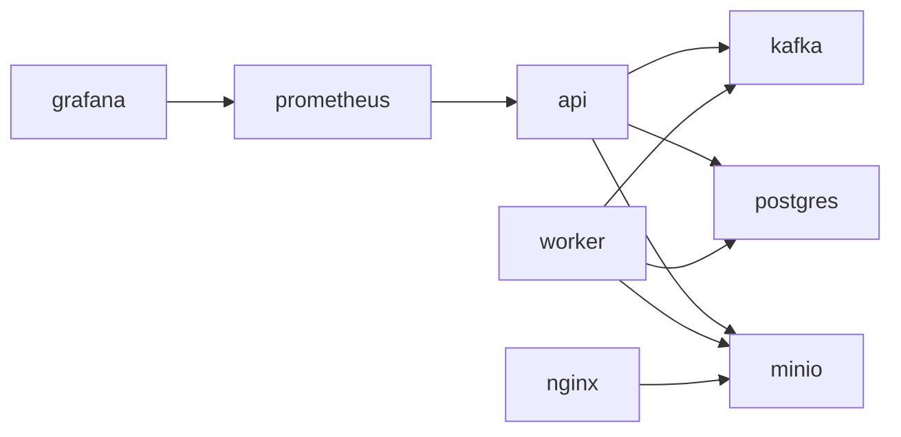

# Развёртывание

## Docker Compose

### Полный стек

Файл `docker-compose.yml` в корне проекта описывает 8 сервисов:

| Сервис       | Образ                  | Назначение                         |
|--------------|------------------------|-------------------------------------|
| `postgres`   | `postgres:16-alpine`   | Реляционная БД (порт `5435:5432`) |
| `minio`      | `minio/minio:latest`   | S3-совместимое хранилище           |
| `nginx`      | `nginx:alpine`         | Реверс-прокси для MinIO            |
| `kafka`      | `apache/kafka:latest`  | Брокер сообщений                   |
| `api`        | (сборка из Dockerfile) | FastAPI приложение                 |
| `worker`     | (сборка из Dockerfile) | Фоновый обработчик                 |
| `prometheus` | `prom/prometheus`      | Сбор метрик                        |
| `grafana`    | `grafana/grafana`      | Визуализация метрик                |

```bash
# Запуск
docker compose up -d

# Логи конкретного сервиса
docker compose logs -f api

# Остановка с удалением томов
docker compose down -v
```

### Зависимости между сервисами



### Переменные для Production

При деплое в production замените значения в секции `environment` сервисов `api` и `worker`:

- `VK_SECRET_KEY` — сгенерировать надёжный ключ
- `DB_PASSWORD` — надёжный пароль
- `MINIO_ROOT_PASSWORD` — надёжный пароль
- `MINIO_PUBLIC_URL` — публичный домен MinIO
- `ANALYSIS_GRPC_URL` — адрес gRPC анализатора
- `LOG_LEVEL` — `WARNING` для production

---

## Kubernetes (kind)

### Предварительные требования

- [kind](https://kind.sigs.k8s.io/docs/user/quick-start/)
- [kubectl](https://kubernetes.io/docs/tasks/tools/)
- [Docker](https://docs.docker.com/get-docker/)

### Манифесты

Все манифесты находятся в `k8s/` (11 файлов):

| Файл                | Ресурсы                          |
|---------------------|-----------------------------------|
| `00-namespace.yaml` | Namespace `umnaya`                |
| `01-configmap.yaml` | ConfigMap с конфигурацией         |
| `02-secret.yaml`    | Secret с паролями                 |
| `03-postgres.yaml`  | Deployment + Service PostgreSQL   |
| `04-minio.yaml`     | Deployment + Service MinIO        |
| `05-kafka.yaml`     | Deployment + Service Kafka        |
| `06-api-deployment.yaml` | Deployment API + init контейнеры |
| `07-api-service.yaml`    | Service API (ClusterIP)      |
| `08-worker-deployment.yaml` | Deployment Worker         |
| `09-nginx.yaml`     | Deployment + Service Nginx proxy  |
| `10-volumes.yaml`   | PersistentVolume + PersistentVolumeClaim |

### Деплой

```bash
# Создать кластер
kind create cluster --name umnaya

# Создать папки для PV на ноде
docker exec umnaya-control-plane mkdir -p /var/lib/umnaya/{postgres,minio,kafka}

# Собрать образ и загрузить в kind
docker build -t umnaya-api .
kind load docker-image umnaya-api --name umnaya

# Применить манифесты
kubectl apply -f k8s/

# Проверить
kubectl get pods -n umnaya

# Открыть доступ к API (в отдельном терминале)
kubectl port-forward -n umnaya svc/api-service 8000:8000 --address 0.0.0.0
```

### Особенности

- **initContainer `wait-postgres`**: ждёт готовности PostgreSQL перед запуском API
- **initContainer `alembic-upgrade`**: применяет миграции перед стартом API
- **livenessProbe**: `GET /healthz` (порт 8000)
- **readinessProbe**: `GET /readyz` (порт 8000)
- **PersistentVolume**: hostPath `/var/lib/umnaya/`
- **StorageClass**: `manual` (требует предварительного создания директорий)

### Обновление

```bash
# Пересобрать и загрузить образ
docker build -t umnaya-api .
kind load docker-image umnaya-api --name umnaya

# Перезапустить поды (подхватят новый образ)
kubectl delete pod -n umnaya -l app=api
kubectl delete pod -n umnaya -l app=worker
```

### Остановка

```bash
# Остановить все поды
kubectl scale deployment -n umnaya --all --replicas=0

# Удалить кластер
kind delete cluster --name umnaya
```

---

## Dockerfile

```dockerfile
FROM python:3.14-slim
WORKDIR /app
COPY requirements.txt .
RUN apt-get update && apt-get install -y --no-install-recommends g++ gcc && \
    pip install --no-cache-dir -r requirements.txt && \
    apt-get purge -y --auto-remove g++ gcc
COPY . .
EXPOSE 8000
CMD ["sh", "-c", "alembic upgrade head && exec uvicorn app.main:app --host 0.0.0.0 --port 8000"]
```

Образ используется как для API (uvicorn), так и для Worker (`python -m app.worker`).
