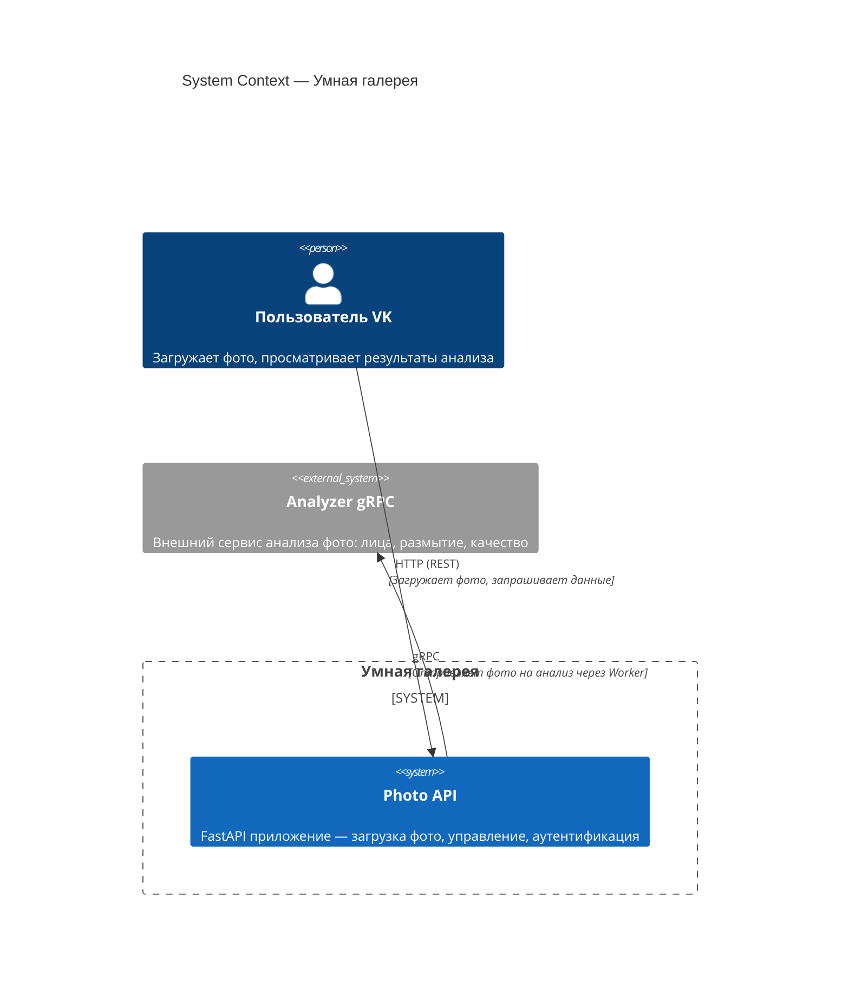
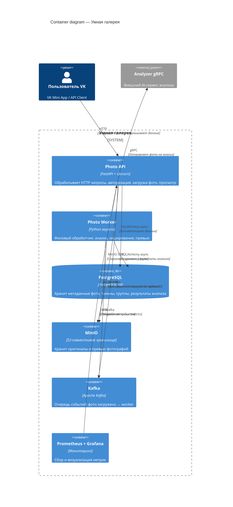

# Умная галерея

**Photo Analysis Service** — асинхронный сервис для загрузки, анализа и управления фотографиями с
детекцией лиц, оценкой качества, поиском дубликатов и идентичных изображений.

---

## Технологический стек

| Компонент          | Технология                        |
|--------------------|-----------------------------------|
| **API**            | FastAPI (Python 3.14)            |
| **База данных**    | PostgreSQL 16 + asyncpg          |
| **ORM**            | SQLAlchemy async                 |
| **Миграции**       | Alembic                          |
| **Объектное хранилище** | MinIO (S3-совместимое)      |
| **Очередь сообщений** | Apache Kafka                  |
| **Анализ фото**    | Внешний gRPC-сервис              |
| **Метрики**        | Prometheus + Grafana             |
| **Контейнеризация** | Docker + docker-compose         |
| **Оркестрация**    | Kubernetes (kind)                |

---

## C4 Context — системный контекст

---

## C4 Container — контейнеры

---

## Быстрая навигация

-   :material-rocket-launch: **Быстрый старт**

    Запустите проект локально или в Kubernetes за 5 минут

    [:octicons-arrow-right-24: Начать](getting-started.md)

-   :material-sitemap: **Архитектура**

    C4 диаграммы, ER диаграмма, Sequence диаграмма потока данных

    [:octicons-arrow-right-24: Смотреть](architecture.md)

-   :material-api: **API**

    Полная документация всех эндпоинтов с примерами

    [:octicons-arrow-right-24: Изучить](api.md)

-   :material-docker: **Развёртывание**

    Docker Compose и Kubernetes манифесты

    [:octicons-arrow-right-24: Развернуть](deployment.md)

-   :material-tune-variant: **Переменные окружения**

    Все конфигурационные параметры сервиса

    [:octicons-arrow-right-24: Настроить](environment.md)

-   :material-folder-open: **Структура проекта**

    Дерево файлов с описанием каждого модуля

    [:octicons-arrow-right-24: Изучить](project-structure.md)

-   :material-chart-box-outline: **Метрики**

    Prometheus метрики приложения

    [:octicons-arrow-right-24: Просмотр](metrics.md)

